# LinkedIn Post Templates & Hooks: A Tactical Guide

**Executive Summary:** Top LinkedIn posts use a clear **structure** (Hook → Context → Body → Call-to-Action).  We analyzed high-engagement posts and social media research to derive concrete examples. Below are **12+ proven hooks** (bold claims, questions, stats, personal insights), **6 full post templates** (with placeholders) for different intents (thought leadership, job news, case study, quick tip, audience question, resource share), and **8 CTA variations**.  We include a concise **editing checklist** for removing AI-like phrasing (no jargon, emojis, strange punctuation) and a **personalization checklist**.  A comparison table summarizes each template’s ideal length, timing, and engagement goals, plus suggested **A/B test** pairs for hooks vs. CTAs.  Finally, a simple Mermaid flowchart helps choose the right template by intent/audience. All advice is backed by LinkedIn best practices and social-media research.

## Anatomy of High-Performing Posts 

 *Figure: Infographic – “The Anatomy of a High-Performing LinkedIn Post.”*  High-performing posts consistently follow a blueprint: a **hook** (1–3 lines) that stops the scroll, brief **context** (2–4 lines) establishing relevance, a value-packed **body** (stories, tips or data in short paragraphs or bullets), and a single clear **CTA**.  For example, a hook might use a **bold claim or question** (e.g. “Your LinkedIn strategy is backwards. Here’s why…”) or an **unexpected statistic** (“I analyzed 500 LinkedIn posts – only 3% had this one thing in common”) to build immediate curiosity.  The body delivers on that promise with a specific insight or story, and a strong ending invites engagement (e.g. “Have you seen this pattern? I’d love to know your thoughts.”).  This structure – hook, context, core value, (optional reiteration), then CTA – has been shown to *triplicate engagement* when used consistently.  High-engagement posts also format text for readability: short lines or bullets, 900–1,200 characters total, and a clear single question or prompt at the end. 

**Key patterns from examples:** Hooks often begin with tension or surprise: e.g. *“I almost gave up on LinkedIn after my first 20 posts flopped…”* or questions like *“Do you ever feel like you’re networking wrong?”*.  Effective hooks may state “the opposite of common advice” or reveal personal struggle. Bodies use story or list formats (before/after, framework, lessons) to deliver value.  Posts close by calling out a specific action: asking a pointed question or requesting a share/comment.  Research confirms this: posts labeled “social” or personal (stories, lessons) generate significantly higher engagement on B2B LinkedIn, whereas obvious promotional/sales content gets lower response. 

## High-Impact Hooks (Opening Lines)

Use the first 1–3 lines to **spark curiosity, emotion or recognition**.  Good hooks include bold claims, personal confessions, surprising stats or direct questions. Below are 12+ proven hook templates – tailor the specifics to your story or data:

- **Contrarian hook:** “Everyone told me to [common advice]. I did the opposite – and it worked better.”  
- **Unexpected stat:** “I ran an experiment with [X] people – only **3%** saw this outcome.”  
- **Provocative question:** “Have you ever tried [unusual approach]? Why it blew my mind.”  
- **Personal confession:** “I almost quit [career/skill] – here’s what made me stick with it.”  
- **Shock statement:** “Stop doing [common practice] if you want to [desired result].”  
- **Curiosity gap:** “What if everything you know about [topic] is wrong?”  
- **Pain-point query:** “Do you struggle with [common challenge]? Here’s why.”  
- **Behind-the-scenes:** “Inside look: how [Company/role] tackles [problem].”  
- **Lesson learned:** “I was convinced [old belief], until [event] happened.”  
- **List teaser:** “The **3 biggest mistakes** teams make when [task] – and how to fix them.”  
- **Outcome preview:** “I tried [new method] for 30 days – the results surprised me.”  
- **Industry myth-buster:** “Everyone says X – here’s the inconvenient truth about it.”  
- **Engagement prompt:** “Imagine achieving [goal] in half the time – sounds impossible?”  

All hooks above aim to create an open loop or strong emotion.  Mix formats (stories vs. data, personal vs. professional) to see what resonates. For example, one high-performing post began *“I almost gave up on LinkedIn after my first 20 posts flopped…”* – a personal story that readers find relatable. Another used a statistic: *“Only 5% of [people/do X]… here’s what they do differently.”* Test hooks and watch which prompts click-throughs.

## Post Templates by Intent

Below are **six sample post templates** (with placeholders) for common LinkedIn intents. Customize each by filling in your details (names, roles, numbers, etc.) and adjusting tone to your voice:

### Thought Leadership Post (Expert Insight)  
“After [number] years working in [industry/role], I finally realized a surprising truth: **[Insight/Contrarian claim]**.  It started when [trigger/event] – for example, [brief anecdote].  That experience taught me **[key lesson or framework]**, which means [implication for audience].  [One or two actionable points or story details]. *What have you learned about [topic] from your own experience?*”

*Example with placeholders:*  
> *“Six months into my first startup role, I discovered the **hardest lessons** aren’t in business school. I was told innovation comes from brainstorming sessions – but after [event] it hit me: true ideas happen when the team is **unhappy with the status quo**. From that point on, I focused on [strategy] and our results tripled.  I’d love to hear: what unconventional insights have you gained in your career?*”

### Job Update Post (Milestone News)  
“I’m excited to share that I’ve joined **[New Company or Role]** as a [Title] starting [Month/Year].  This opportunity with [Company] is meaningful because [reason: mission, growth, alignment with your passion].  I want to thank [Colleagues/Mentor] for [support/learning] along the way.  In this new position I’ll be focusing on [key responsibilities or goals]. 

*What career moves are you most proud of lately?*”

*Example with placeholders:*  
> *“Big news: I’ve joined **ABC Corp** as Senior UX Designer beginning July 2026!  I’m thrilled because I get to apply my passion for user-centered design to [industry/problem].  Thank you to [Previous Manager/Team] for mentoring me over the past [X] years.  In this new role, I’ll lead projects on [specific initiative].  If you’ve recently made a move or hit a big milestone, I’d love to hear about it!*”

### Project/Case Study Post  
“Last quarter, my team and I tackled **[Project Name]** at [Company].  We faced [challenge] (for example, [specific obstacle]).  Here’s how we approached it: *[Step 1/Insight]*, *[Step 2/Insight]*, *[Step 3/Insight]*.  The result? We achieved **[specific metric or outcome, e.g. “a 40% improvement in X”]** and learned [key takeaways]. 

[If applicable: short quote or testimonial]. *Which part of this process would you use in your work? Let me know below.*”

*Example with placeholders:*  
> *“I recently led **Project Phoenix** at XYZ Corp, where the challenge was to reduce our onboarding time by 50%.  Our team rethought the training process in three steps: (1) Interviewing users to pinpoint confusion, (2) Building an interactive guide, (3) Iterating based on feedback. In the end, we cut onboarding time by **60%** and increased team satisfaction.  We learned that listening to every stakeholder early on makes all the difference.  Has your team tried a similar process? Share your experience!”*

### Quick Tip / How-To Post  
“**Quick Tip:** To [achieve a small improvement], try [specific action].  For instance, instead of [common but less effective approach], consider [better method].  This one change can [positive outcome in simple terms].  I’ve found [brief anecdote or data] that proves it works. 

*If this tip helps you, feel free to share it with your network!*”

*Example with placeholders:*  
> *“**Quick Tip:** Want to boost your daily productivity? Try the *two-minute rule*: if a task can be done in under 2 minutes, do it immediately.  Many people stall on small tasks like responding to an email, but by acting fast, you save time in the long run.  I tested this for a week and cleared my to-do list in half the time.  Do you have a favorite productivity hack? Drop it below!”*

### Question-to-Audience Post (Engagement Driver)  
“I’ve been thinking about [industry trend or question] lately.  For example: *[Pose a relevant dilemma or comparison, e.g. “Strategy A or Strategy B?”]*  In my experience, [brief insight or story].  But I’m curious: **what do you do?**  Do you [option A] or [option B], and why? 

*Share your perspective below – let’s discuss!*”

*Example with placeholders:*  
> *“I keep seeing advice that says “network obsessively,” but is that really the best approach?  Last month I tried focusing on *quality* connections instead of quantity.  The result was deeper conversations, but fewer leads overall.  Which strategy has worked better for you – broad networking or targeted outreach? Comment your experience!”*

### Resource Share Post (Tool/Link Recommendation)  
“I came across an excellent resource on [topic]: **[Resource Title]** by [Author/Publisher].  It covers [brief description: e.g. “5 data-driven tips for X”].  A quick takeaway is [one key point or insight].  If you deal with [related challenge], this [article/tool/report] might be helpful. 

(*Link in the comments*) *What resources do you turn to for [topic]?*”

*Example with placeholders:*  
> *“If you’re working on content strategy, check out **‘The 5 Best Content Analytics Tools’** by DataMag.  It dives into tools for tracking engagement and one key insight is that **user feedback** often predicts success better than sheer traffic numbers.  I found this especially useful when refining our blog strategy.  (Link is in the first comment.)  What tools or guides have you found valuable recently?*”

## Closing Call-to-Action Variations

Strong CTAs (at the end of posts) are specific and invite action. Here are 8 human-sounding examples; mix and match based on your goal:

1. “What’s your experience with this? Share your thoughts below.”  
2. “Have you tried something like this? Let me know how it went.”  
3. “If this resonates, feel free to drop a ‘Me too’ or share your story.”  
4. “Tag someone who needs to hear this today.”  
5. “Do you agree or disagree? Let’s discuss!”  
6. “What would you add to this list? Comment below!”  
7. “If you found this helpful, please like and share.”  
8. “Looking forward to your take – leave a comment below.”  

Use **one CTA per post** (multiple asks dilute impact).  Align the CTA with your post’s tone: for advice posts, use discussion prompts (“What’s worked better for you?”); for personal stories, invite relatability (“How about you?”).  For resource or promo posts, “Click the link in comments to learn more” or “Subscribe for updates.”

## Editing for a Natural, Human Voice

After writing, apply these style checks to remove any “AI-like” or corporate signals:

- **Authenticity:** Use personal pronouns and concrete examples; avoid vague buzzwords. LinkedIn favors posts with “authenticity, humanity, and humor” over sterile jargon.  Replace generic phrases (“cutting-edge solution”) with specifics from your experience.
- **Tone & Clarity:** Write as you speak. Use contractions (“I’m” vs “I am”), short sentences, and vary sentence length for flow. Avoid formal clichés (no *“In this post, I will discuss…”* intros).   
- **Formatting:** Break text into short paragraphs or bullets. Ensure one idea per sentence. Use normal punctuation (avoid odd triple-dots or excessive dashes).  LinkedIn is read mostly on mobile, so each line should hold only a sentence or two.  
- **No Emojis/AI Jargon:** Delete emojis, ASCII art, or references to “AI tools.” Don’t use overused corporate phrases (“synergy,” “pivot,” etc.). Keep it professional but friendly. 
- **One Hashtag Rule:** Limit yourself to 2–5 relevant hashtags (e.g. #YourIndustry, #Topic). Too many tags can seem spammy. Place them at the very end or in a comment.
- **Single CTA:** Make only one ask (as above). Ending with multiple CTAs (like follow *and* share *and* comment) confuses readers.  
- **Proofread for Naturalness:** Read aloud. If something sounds stiff or repetitive, rephrase it as a conversation. Inject a bit of personality (a touch of humor or a relatable aside is fine). 

_Remember_: your unique perspective **is** the value. As one LinkedIn expert advises, “anchor your writing in your own voice, experience and perspective [to feel] real… authenticity comes from the nuances only you bring”. Don’t polish away your individuality.

## Personalization Checklist

Before posting, tailor templates with your details:

- Replace placeholders ([Your Role], [Company], [Number] etc.) with your real info.  
- Insert actual data or outcomes (e.g. a specific % increase, time saved, etc.). Numbers and names add credibility.  
- Match tone to your niche: if you’re in finance, use precise terms; in creative fields, you might be more informal.  
- Use niche examples or jargon *sparingly* to connect with peers (but explain any specialized term).  
- Bring in your personal stories or analogies. Even a brief anecdote about *you* will make it distinct.  
- Align content with your audience’s pain points and interests. For B2B, emphasize ROI and lessons; for communities, highlight shared values.  
- Update CTAs to fit your style: e.g. if you’re usually playful, a CTA might be “Drop your #1 tip!” vs. a formal “Please comment below.”  

Use this checklist to ensure each post *sounds like you*. Authentic posts that reflect your personal journey or voice will perform best.

## Template Comparison

| **Template (Use Case)**   | **Ideal Length**        | **Best Time to Post**                 | **Engagement Goal**                              |
|--------------------------|-------------------------|---------------------------------------|--------------------------------------------------|
| Thought Leadership       | 900–1,200 characters (~100–150 words) | Weekday mid-morning (Tue–Thu 9–11am) | Build authority: likes/shares, profile follows. Encourage discussion around your expertise.  |
| Job Update               | 600–800 characters (~70–100 words)   | Early week (Tue 9–10am)             | Celebrate milestone: congratulate, comments. Expand network (recruiter/outreach DMs).     |
| Project Case Study       | 800–1,000 characters (~90–120 words)  | Mid-week (Wed 10–11am)             | Showcase results: saves/bookmarks. Gain credibility via comments/questions on process.    |
| Quick Tip / How-To       | 300–600 characters (~40–80 words)   | Wed–Thu late morning (11am–1pm)    | Practical value: quick likes/saves. Trigger shares if tip is useful.                      |
| Question-to-Audience     | 200–400 characters (~30–60 words)   | Wed 12pm (noon)                     | High comments: spark discussion. Use to gather opinions or advice.                       |
| Resource Share           | 800–1,200 characters (~90–150 words)  | Tue 2–3pm or Thu 11am               | Drive clicks/traffic: link clicks. Shares if resource is broadly valuable.               |

*(All timings are general guidelines; midweek mornings often see peak LinkedIn activity.)* 

These are estimates. Shorter posts (Quick Tip, Question) rely on a punchy hook since they can’t delve deep. Longer posts (Thought Leadership, Case Study) need more lines to deliver value but still aim to be read in ~1 minute. The engagement goal column highlights the typical outcome: for example, Question posts are optimized for **comments** (you’re explicitly inviting replies), whereas Resource posts drive link clicks and shares.

## A/B Test Ideas for Hooks & CTAs

Experiment to see what resonates: try pairing different hook styles and CTAs head-to-head. For example:

- **Hook A vs. B:**  
  - A: Question hook – *“Do you ever feel like you’re [struggling with X]?”*  
  - B: Bold statement – *“Stop [doing X] if you want to [goal].”*  

- **Hook C vs. D:**  
  - C: Personal anecdote – *“I was sure [common belief] until [experience] proved me wrong.”*  
  - D: Data-driven claim – *“[X] out of [Y] professionals avoid [practice] – here’s why.”*  

- **CTA A vs. B:**  
  - A: Engaging question – *“What would you add to this list? Comment below!”*  
  - B: Share prompt – *“Tag someone who should see this.”*  

- **CTA C vs. D:**  
  - C: Direct invite – *“Share your favorite tip in the comments.”*  
  - D: Soft follow – *“Follow me for more insights on [topic].”*  

According to experts, testing different phrasing can reveal what your audience prefers. For instance, one post might ask a yes/no question, while another asks an open-ended one; compare which gets more comments. Likewise, alternate between asking for shares/tags versus asking for opinions. Keep all other factors equal (same topic, time) when A/B testing. Track metrics (comments, shares, clicks) to refine your hooks and CTAs over time.

## Choosing the Right Template

```mermaid
flowchart LR
    Start([What is your post’s purpose?])
    Start -->|Establish thought leadership| TL(Thought Leadership Template)
    Start -->|Announce career news| JU(Job Update Template)
    Start -->|Showcase a project| CS(Case Study Template)
    Start -->|Give a quick tip| QT(Quick Tip Template)
    Start -->|Engage audience| QA(Question Template)
    Start -->|Share a resource| RS(Resource Share Template)
    TL --> Tailor1[Audience: Industry peers]
    JU --> Tailor2[Audience: Recruiters/Colleagues]
    CS --> Tailor3[Audience: Clients/Team]
    QT --> Tailor4[Audience: Learners/Followers]
    QA --> Tailor5[Audience: Broader Network]
    RS --> Tailor6[Audience: Industry/Followers]
```

*Figure: Template choice flowchart.*  Select your template by first clarifying the **intent** of your post. Then consider **your audience**: for example, Thought Leadership posts suit peers in your industry, while Job Updates target colleagues and recruiters. This simple decision path helps pick the right format (hook style, tone, and CTA) for maximum impact. 

---

**Sources:** Industry best practices and analytics were synthesized from LinkedIn-focused articles and studies, ensuring advice is actionable and evidence-based. All example templates and guidelines above reflect proven strategies from top LinkedIn content creators and social media research.  

